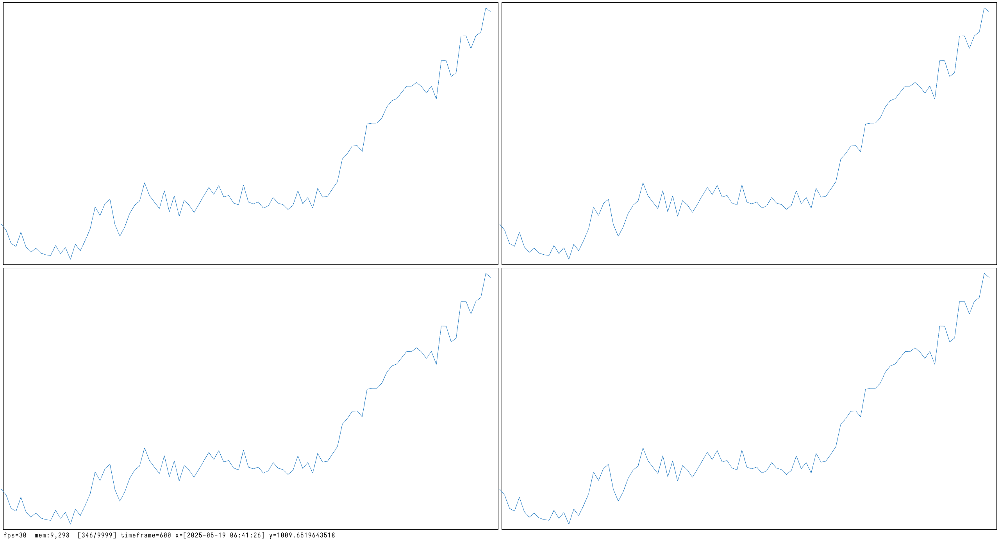

# raycandle
A simple library for plotting candlesticks with an simple api similar to matplotlib.

## Installation

### Clone the repo 
```bash 
  git clone https://github.com/fskamau/raycandle.git raycandle
  cd raycandle
  ```
  
### Clone raylib and build it statically with -fPIC

 ```bash 
 git clone --depth=1 https://github.com/raysan5/raylib.git Raylib
 cd Raylib
 mkdir build && cd build 
 cmake -DCMAKE_INSTALL_PREFIX=../../raylib -DBUILD_SHARED_LIBS=OFF  -DCMAKE_BUILD_TYPE=Release  -DCMAKE_POSITION_INDEPENDENT_CODE=ON  ..
 make -j8
 make install
 cd ../..
 rm -rf Raylib
 ```
 
### Build raycandle with raylib 
 ```bash
(
 set -e
 cd raycandle/craycandle
 make
 mv build/* ../
 cd ..
 rm -r craycandle
) 
```

### Now, raylib can be removed safely
```
rm -r raylib
```

### Run pip install to install (activate your environment)
 ```bash 
  pip install .
 ```
 
## Post installation
 This snippet will show a simple window if everything is working correctly.
 ```bash 
 python -c "import raycandle; raycandle.Figure().show();"
 ```
 which should display something closer to 
 
  
### You may run examples with 
  ```python
  python examples/run-all-examples.py 
  ```	 
  or any example in then  folder
  
  #### Simple png of a simple window 
  
